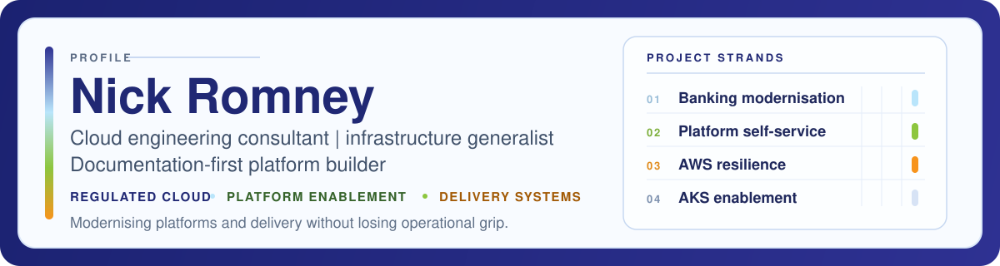

  

  <a href="https://www.nickromney.com">Website</a>
  ·
  <a href="https://www.nickromney.com/writing/">Writing</a>
  ·
  <a href="https://www.nickromney.com/certifications/">Certifications</a>
  ·
  <a href="https://www.nickromney.com/style/">Non-AI thesis proofreader</a>
  ·
  <a href="https://www.linkedin.com/in/nickromney/">LinkedIn</a>
  ·
  <a href="https://www.credly.com/users/nick-romney.e2b44c67/badges#">Credly</a>

I am a hands-on cloud and infrastructure engineer who has spent 25 years keeping systems running, helping development and operations teams work better together, and turning fragile manual processes into repeatable documented workflows.

Most recently, that has meant helping security-conscious teams modernise delivery with Kubernetes, Terraform or Pulumi, cloud networking, security guardrails, disaster recovery, and the documentation that lets the next person operate the thing with confidence. Across that time, it has also meant being the person responsible for most things with a plug, and certainly most things with an IP address.

## What I Do

- Modernise regulated and business-critical platforms across Azure, AWS, Kubernetes, Terraform, Pulumi, Linux, and Bash
- Build internal platform capabilities with self-service infrastructure, GitHub Actions, secure runner patterns, and practical onboarding
- Improve resilience with stronger networking, disaster recovery, identity, backup, and repeatable infrastructure definitions
- Distil messy processes into scripts, diagrams, runbooks, and course material that teams can actually use

## Current Threads

- Client work across banking infrastructure, platform engineering, AWS resilience, and delivery enablement
- Platform experiments around local Kubernetes, Lima, and repeatable infrastructure workflows
- Small practical tools for certificates, smoke testing, and developer utilities
- Writing about cloud, security, AI-assisted development, and web tooling at [nickromney.com](https://www.nickromney.com)
- Teaching with the [Terraform AKS baseline clusters course](https://www.udemy.com/course/terraform-aks-baseline-clusters-deployment-walkthrough/?referralCode=B78129C45377998C5532)

## Websites I Own or Run

- [Avuncular](https://avuncular.co/)
- [By Lunchtime](https://bylunchtime.com/)
- [CI/CD Pipelines](https://cicdpipelines.com/)
- [Online Safety Alliance](https://www.onlinesafetyalliance.org/)

## Project Strands

These are the recurring strands that cut across the projects I take on:

| Strand | What it looks like in practice |
| --- | --- |
| Banking modernisation | Private AKS, ExpressRoute, Terraform modules, WAFs, service mesh, multi-environment delivery, and diagrams-as-code for regulated digital banking platforms |
| Platform self-service | Internal developer platforms for 40+ teams using Pulumi, reusable GitHub Actions, secure runner hardening, onboarding docs, and standard deployment paths |
| AWS resilience and recovery | EKS optimisation, IAM and AWS SSO, ransomware-aware backup and disaster recovery design, Redshift analytics, and legacy PHP containerisation |
| AKS enablement and teaching | Turning reference architectures into Terraform, GitOps workflows, Azure policy baselines, helper scripts, and practical course content teams can apply immediately |

## Selected Public Work

| Project | What it is |
| --- | --- |
| [certconv](https://github.com/nickromney/certconv) | Non-invasive certificate inspection and conversion tool with an optional TUI |
| [website-testing](https://github.com/nickromney/website-testing) | Minimal smoke-testing framework that is evolving from bash helpers into a Go CLI and TUI |
| [platform](https://github.com/nickromney/platform) | Platform-engineering experiments across kind, Lima, Kubernetes, and local lab environments |
| [visualsubnetcalc](https://github.com/nickromney/visualsubnetcalc) | Visual subnet design tool for planning networks and collaborating on address layouts |
| [frankenphp-moodle](https://github.com/nickromney/frankenphp-moodle) | Container baseline for running Moodle on FrankenPHP and MariaDB with repeatable verification |
| [laemp](https://github.com/nickromney/laemp) | Debian and Ubuntu host provisioning script with optional Moodle deployment |

## Credentials

I hold the [CISSP](https://www.isc2.org/Certifications/CISSP), recognised as comparable to the U.K. Master's degree standard, alongside certifications across Terraform, Kubernetes, security, AWS, Azure, and Oracle Cloud Infrastructure.

The hands-on ones matter to me as much as the paper ones, so that list includes `CKA`, `CKAD`, `CKS`, the HashiCorp Terraform Associate, and a fairly deep run through AWS and Azure tracks.

## Working Style

> I occasionally describe myself as an "internet plumber".
>
> The job is not finished when the system works once. It is finished when the process is tuned, the boring parts are automated, and the documentation exists for the next person.
